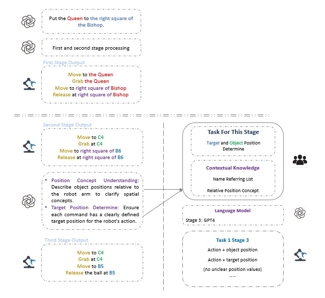
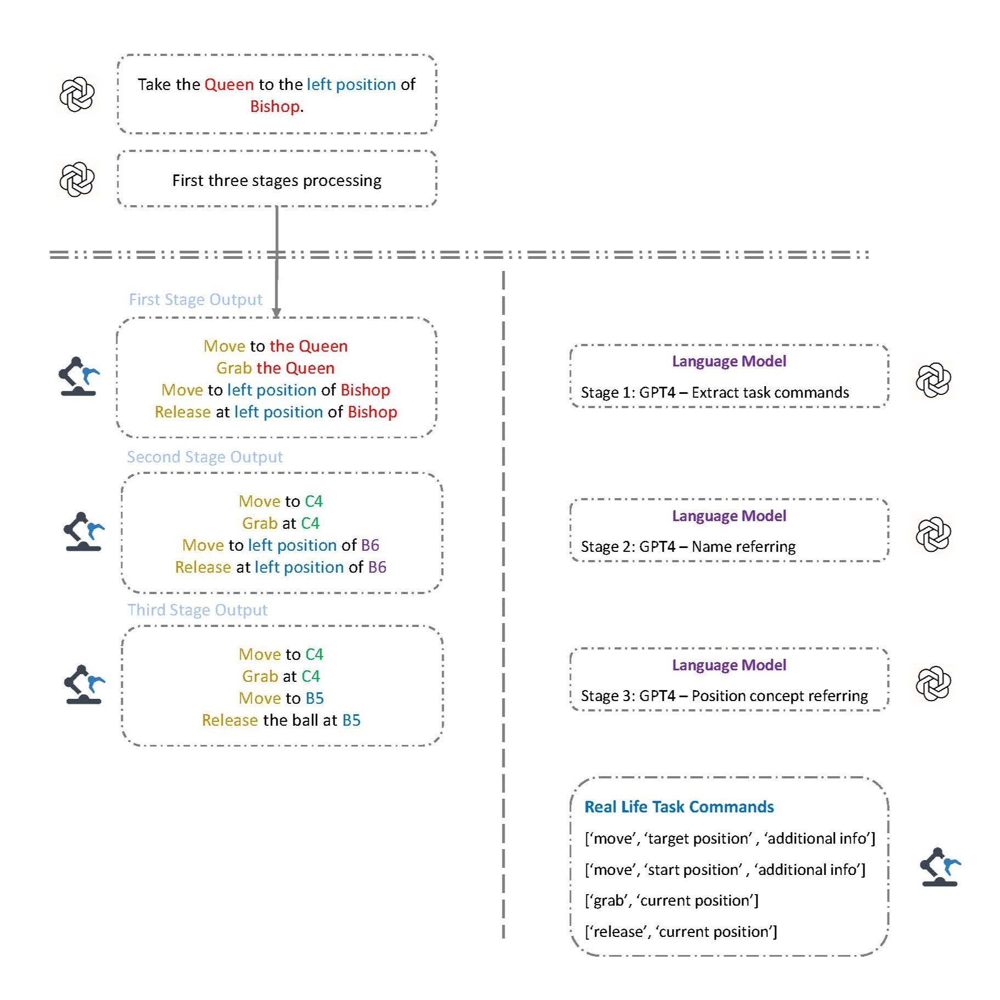

# 基于大语言模型的机器人控制

本项目旨在构建一个利用大型语言模型（Large Language Models, LLMs）进行机器人控制的交互平台，使机器人能够通过自然语言指令执行复杂任务。这种方法消除了传统硬编码控制的需求，使机器人更加智能、灵活，并可直接适应不同的应用场景。

## 项目背景

近年来，随着深度学习和大型语言模型的发展，机器人控制系统的数据处理能力得到了显著提升。然而，如何让机器人能够直接理解并执行人类的自然语言指令仍然是一个挑战。本项目正是基于这一需求，设计了一个能够解析自然语言指令并生成可执行指令的平台，涵盖了语言模型处理部分、机器人控制系统和模拟系统。

本项目的核心特点包括：
- **自然语言解析**：利用 GPT-4 对复杂指令进行拆解、解析，并生成明确的执行命令。
- **环境感知与任务推理**：通过多阶段处理流程，确保机器人能够理解任务的上下文，并解析模糊的目标对象和位置。
- **实时控制与反馈机制**：指令在执行前会经过逻辑验证，确保合理性，同时支持实时反馈调整。
- **高可迁移性**：可以轻松应用于不同机器人平台，如工业机器人、家庭服务机器人、自动驾驶系统等。

## 机器人控制的核心架构

该平台主要由以下三个部分组成：

1. **语言模型处理系统**
   - 解析自然语言指令。
   - 拆解复杂任务为基本可执行任务。
   - 处理名称指代、位置解析及逻辑验证。

2. **机器人控制系统**
   - 解析指令并转换为可执行的运动轨迹。
   - 计算机器人关节角度，确保运动精确。
   - 采用增强 PID 控制，优化机器人运动过程。

3. **仿真系统**
   - 使用 MuJoCo 进行虚拟环境模拟。
   - 评估机器人在不同任务场景下的表现。

## 任务解析流程

为了确保机器人能够准确理解和执行指令，本项目将语言处理拆分为四个关键阶段：

### 1. 指令拆解

- 解析复杂指令并拆分为独立的基本任务。
- 确保每个子任务均为可执行的基本操作。

### 2. 名称解析

- 解析指令中涉及的对象名称，消除歧义。
- 结合上下文信息确定具体的目标对象。

### 3. 位置解析

- 处理相对位置描述，转换为机器人可识别的绝对坐标。
- 结合环境信息计算最优执行路径。

### 4. 逻辑验证

- 检查指令的合理性，避免逻辑冲突。
- 确保机器人能够物理执行指定操作。

## API 使用说明

本系统支持基于 OpenAI GPT-4 API 进行指令解析，用户可以通过 `llmAPI/api.py` 配置 API Key 以实现云端计算。

### API 主要功能：
- **指令解析**：接收用户输入的自然语言指令，并解析为结构化任务。
- **任务分解**：自动识别指令中的多个子任务，并进行任务调度。
- **环境感知**：结合传感器输入和历史状态，提高解析准确率。
- **自定义任务**：可扩展到工业机器人、家用机器人等不同应用场景。

## 运行环境与安装步骤

### 先决条件
- Python 3.8 或更高版本。
- MuJoCo 210（最新版本）。
- 推荐使用 Mamba 进行环境管理。

### 安装步骤
```bash
git clone https://github.com/zniihgnexy/niryo_project.git
cd niryo_project
mamba env create -f mamba_mujoco_base.yml
conda activate mujoco
pip install -r requirements.txt
```

## 运行模拟演示

单指令模拟（示例：移动皇后到 C2）：
```bash
python main_simulation.py
```
[单指令模拟视频](https://github.com/user-attachments/assets/400ba2c1-fa2e-46e6-ac44-b870bc80d0c0)

多指令模拟（示例：移动皇后到远处，同时移动兵到对角格子）：
```bash
python main_simulation_multi.py
```
[多指令模拟视频](https://github.com/user-attachments/assets/71c3d2f9-7d9a-4fef-a84f-e60a670d1be6)

## 未来展望

本项目已成功实现了基于自然语言的机器人控制，但仍有许多优化方向可探索：
- **提高解析准确率**：进一步优化语言模型的任务拆解与环境推理能力。
- **增强实时反馈系统**：让机器人能够在任务执行过程中动态调整决策。
- **拓展应用场景**：从棋盘环境扩展到更多实际应用，如工业制造、仓储物流、医疗机器人、农业自动化等。
- **结合强化学习**：提升机器人在未知环境中的自适应能力。
- **多模态融合**：结合语音、视觉和触觉输入，提高机器人对复杂环境的理解能力。

## 项目结构
```bash
niryo_project/
├── figures/               # 项目图片
├── llmAPI/                # GPT-4 API 配置
├── scripts/               # 主要代码文件
├── main_simulation.py     # 单指令模拟脚本
├── main_simulation_multi.py # 多指令模拟脚本
├── requirements.txt       # 依赖项
├── mamba_mujoco_base.yml  # 环境配置
├── README.md              # 项目说明
```

本项目展示了语言模型在机器人控制中的巨大潜力，并为未来基于自然语言的人机交互奠定了坚实基础。

