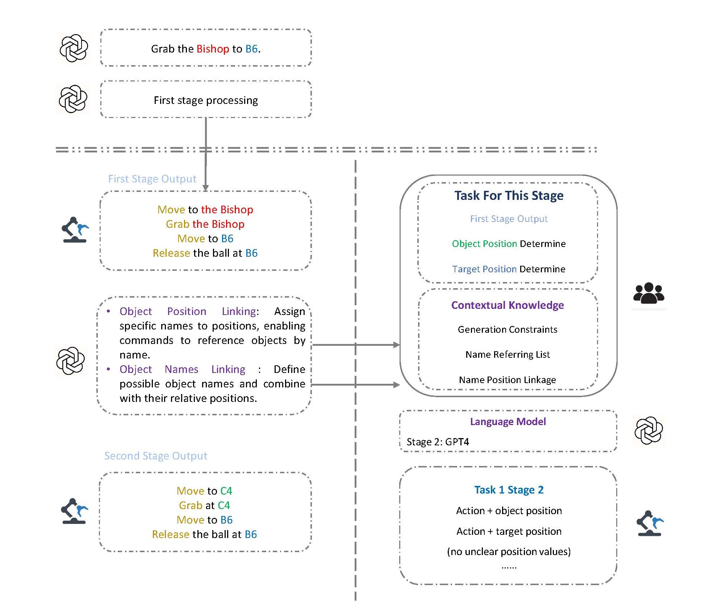

# Robot Control Using Large Language Model

The structure of the project is as following picture:


The project is divided into two parts: the hard part and the soft part. The hard part is the robot arm control part, which is responsible for the control of the robot arm. The soft part is the language model part, which is responsible for the generation of the instruction.

For the language model part, we use the GPT-4 model from OpenAI. The model is used to generate the instruction for the robot arm. The instruction is then sent to the robot arm control part, which is then used for the control of the robot arm.

The four stages of the language model are as follows:


The first stage is used to split the instruction into multiple smaller parts.


The second stage is used to clear the name referring inside a natural language instruction. As in the example below, the instruction "queen" also refers to the piece at B6.



The third stage is used to clear the position referring inside a natural language instruction. As in the example below, the instruction "right square of B6" also refers to the position at B5.


The final stage here is teh final check of overall logic and the consistency of the instruction.


# Project Environment Setup

This document provides instructions for setting up the project environment.

## Prerequisites

- Python 3.8 or higher
- mujoco 210 (newest version)
- no mujoco-py, only using mujoco
- mamba (optional, but recommended)

## Installation

1. **Clone the repository:**

    ```sh
    git clone https://github.com/zniihgnexy/niryo_project.git
    cd niryo_project
    ```

2. **Create a virtual environment:**

    ```sh
    mamba env create -f mamba_mujoco_base.yml
    ```

3. **Activate the virtual environment:**

    ```sh
    conda activate mujoco
    ```

4. **Install the required packages:**

    ```sh
    pip install -r requirements.txt
    ```

## Running the Simulation Demo

**Run the simulation scripts for single instruction and multiple instructions:**

```sh
python main_simulation.py
python main_simulation_multi.py
```
These two are example videos of the simulation. The first one is a single instruction type of moving task robot simulation, and the second one is a complex logic of multi-instructions simulation.

See the videos below:

**Single-instruction:** In this video, the input command is "move the queen to C2". The robot will move the small green ball (queen at B6) to square C2.

https://github.com/user-attachments/assets/400ba2c1-fa2e-46e6-ac44-b870bc80d0c0


**multi-instruction:** IN this video, the input command is "move teh queen to its further square and move the pawn to its diagonal square". The robot will move the queen (ball at B6) to square C6 and the pawn (ball at B3) to square C2.

https://github.com/user-attachments/assets/71c3d2f9-7d9a-4fef-a84f-e60a670d1be6


## Notes for Language model

This experiment is based on GPT-4 language model, therefore the API key is required. Please setup your own key in the llmAPI/api.py file. (You can get the key from https://beta.openai.com/account/api-keys)

For now the api file has **not been uploaded**.

## Project Structure

The project structure is as follows:
